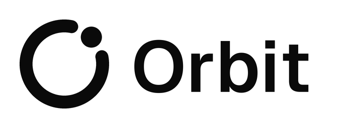
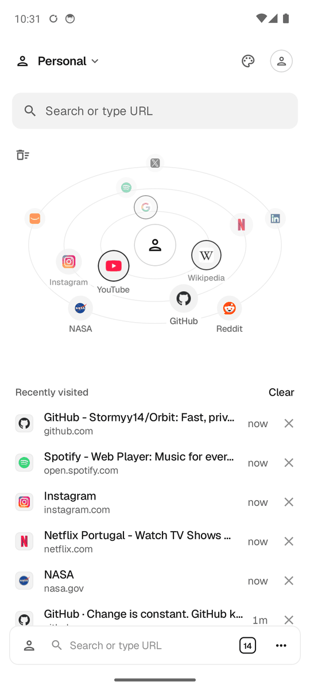
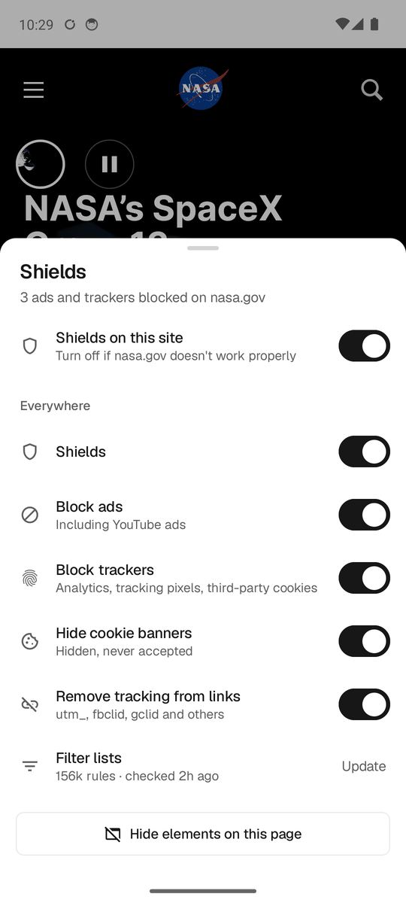
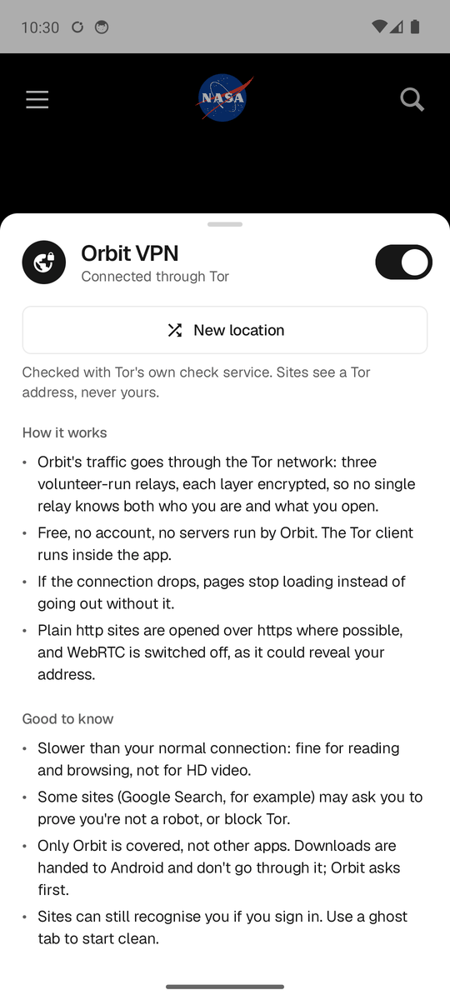
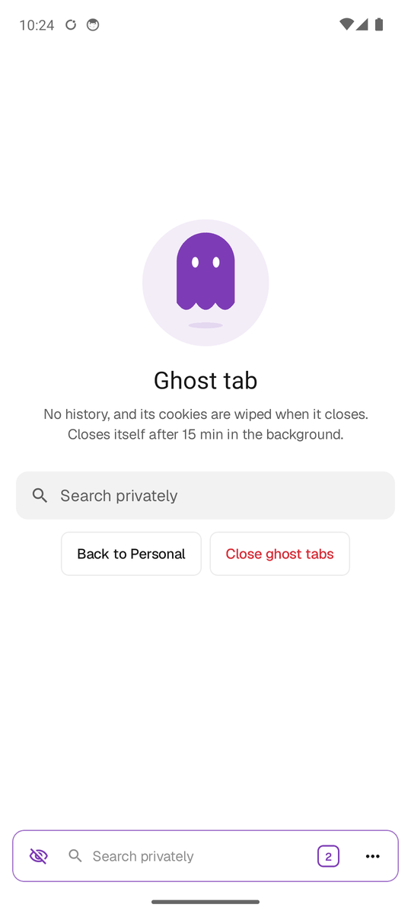
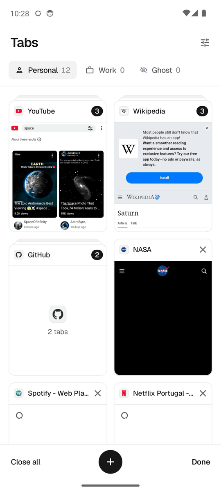
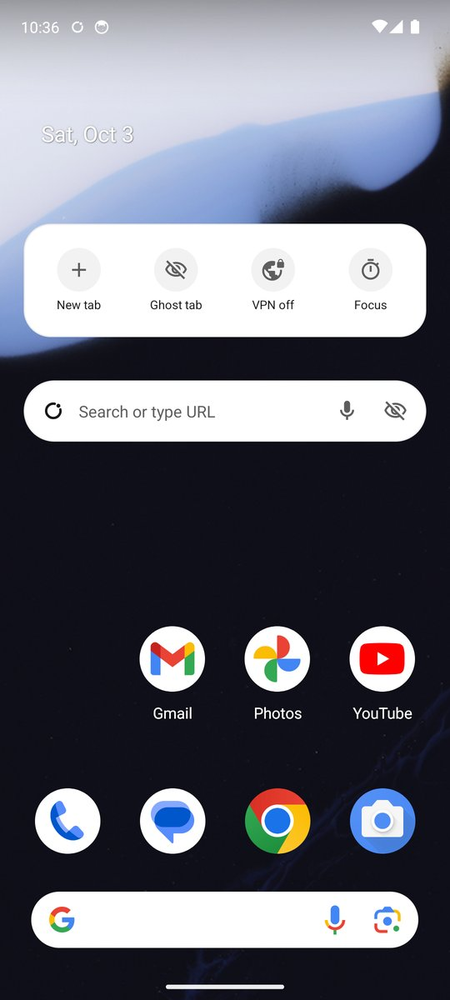
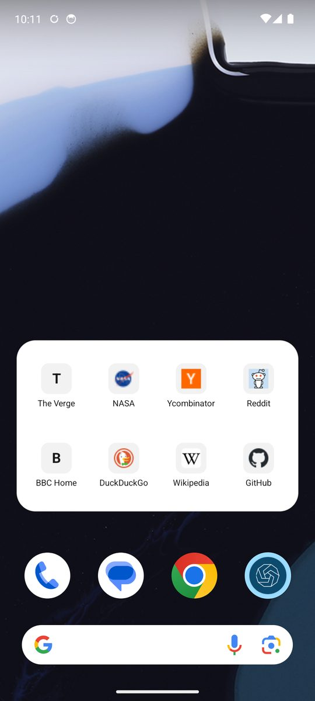

<p align="center">
  
</p>

<p align="center">
  <b>A fast, private Android browser you use with one thumb.</b><br>
  Built-in ad &amp; tracker blocker, free Orbit VPN, ghost tabs and a start page your sites orbit around.<br>
  No analytics, no ads, no account needed.
</p>

<p align="center">
  <a href="https://github.com/Stormyy14/Orbit/releases/latest"></a>
  
  <a href="LICENSE"></a>
</p>

<p align="center">
  
  
  
  
  
</p>

## Why Orbit

- **Blocks ads and trackers for real.** EasyList, EasyPrivacy and the cookie-banner list, kept up
  to date on your phone: ads, trackers, cookie walls and YouTube ads are gone.
- **A free VPN inside the browser.** Orbit VPN hides your IP address through the Tor network.
  No account, nothing to pay, and it never quietly falls back to your real connection.
- **Made for one hand.** A floating bar you swipe to switch tabs, a long-press arc for quick
  actions, and one search field for sites, searches, `!bangs` and commands.
- **Tidy by design.** Spaces keep work and personal apart (with separate logins), tabs on the same
  site stack into one group, and ghost tabs clean up after themselves.
- **Yours.** Themes, accent colours, fonts, address bar on top or bottom, wallpapers, app icons
  and home-screen widgets.

## Download

1. On your phone, open the **[latest release](https://github.com/Stormyy14/Orbit/releases/latest)**
   and download `Orbit-<version>.apk`.
2. Open it and allow your browser or Files app to *install unknown apps* when Android asks.
3. Tap **Install**. Optionally make Orbit your default browser in
   *Settings → Apps → Default apps → Browser app*.

Orbit updates itself: when a new version is out it shows what's new and installs it with one tap
(Android asks you to confirm). Needs Android 8.0+ with **Android System WebView** kept up to date
from Google Play, which is the web engine.

<details>
<summary>Verify the download</summary>

Android shows a "Play Protect" warning for apps that don't come from Google Play; that's normal
for apps installed from GitHub. Each release lists the APK's SHA-256, and every release is signed
with the same key, which you can check with `apksigner verify --print-certs Orbit-<version>.apk`:

```
Release signing certificate SHA-256:
0d:f0:80:3f:1d:73:5c:fd:a2:f0:b3:20:88:6b:19:9f:63:bf:b4:6b:b8:a7:78:e4:98:5e:53:bc:ee:a5:a8:63
```
</details>

## Features

**Privacy**
- **Shields:** network blocking with the lists' rules and exceptions, hiding of leftover ad boxes
  and cookie banners (never clicking "accept"), YouTube ad removal, third-party cookie blocking,
  tracking codes (`utm_`, `fbclid`, `gclid`…) removed from links, and Global Privacy Control.
  Every part has its own switch, and Shields can be turned off for one site.
- **Orbit VPN:** everything Orbit loads goes through Tor, with a Tor client running inside the
  app. While it connects, pages wait; while it's on, WebRTC is off and http sites open over https.
- **Ghost tabs:** private tabs with their own cookie jar that close themselves after 5–60 minutes
  in the background, kept out of screenshots and the recent-apps screen.
- **Focus:** block distracting sites for 15–90 minutes, with a 5-minute "open anyway".

**Browsing**
- **Orbit start page:** your favorite and most-visited sites on three tilted orbits you can spin,
  plus recently visited pages.
- **Orbit bar:** swipe ←/→ to switch tabs, ↑ for all tabs, ↓ to reload; long-press and slide for
  Back, Reload, Reader, New tab, Ghost tab and Forward.
- **Search:** Google by default (or DuckDuckGo, Brave, Startpage, Ecosia, Bing); `!yt`, `!w`,
  `!gh` and other bangs; `>commands`; `@spaces`; open tabs and history; voice input.
- **Tabs grouped by site:** several tabs on one site become one stack in the tab switcher; tap
  it to see them all.
- **Preview** a link in a card, **Reader view**, **Hide elements** on any page, **Tab history**,
  find in page, desktop mode and dark websites.
- **Background play:** video and music keep playing with Orbit minimized, with controls in the
  notification, on the lock screen and from headset buttons.

**Organize and make it yours**
- **Spaces** (Personal, Work…) with their own tabs, history, cookies and logins.
- **Profiles**, optionally backed up to your own Google Drive and restored on another phone.
- **Customize:** theme (System, Light, Dark, Black), accent colour, corners, font, text sizes,
  address bar position, start page sections and wallpaper, and the launcher icon.

## Home-screen widgets

<p align="center">
  
  
</p>

- **Search:** opens Orbit straight into search; the mic starts voice search, the eye opens a
  ghost tab.
- **Quick actions:** new tab, ghost tab, Orbit VPN (shows whether it's on) and Focus.
- **Favorites:** up to eight of your favorite sites, one tap each.

Long-press your home screen → *Widgets* → *Orbit*. They follow the phone's light or dark mode.

## Privacy and security

Everything stays on your phone: no analytics, no crash reports, no Orbit servers, and app data
is excluded from backups. Ad and tracker matching happens on the device. [PRIVACY.md](PRIVACY.md)
lists exactly what is stored and every request the app makes; [SECURITY.md](SECURITY.md) explains
how Orbit is hardened and how to report a vulnerability privately.

## Known limits

- Shields doesn't run scriptlets (rules that inject code), so a few anti-adblock walls get
  through, and YouTube ad removal may need updates when YouTube changes.
- Orbit VPN is Tor: slower than a paid VPN, some sites challenge or block it, you can't pick a
  country, and it doesn't support bridges. Downloads are handled by Android, outside the VPN
  (Orbit asks first).
- Site requests for the camera, microphone and location are always refused.
- `blob:` downloads aren't supported yet.
- Spaces and ghost tabs need WebView 121+ for separate cookie jars (the app says so if not).

## Build from source

Requirements: JDK 17, Android SDK 36.

```sh
./gradlew :app:assembleDebug           # app/build/outputs/apk/debug/app-debug.apk
./gradlew :app:assembleRelease         # minified release
./gradlew :app:testDebugUnitTest       # filter engine tests
```

Release signing is read from `~/.gradle/gradle.properties` (`ORBIT_STORE_FILE`,
`ORBIT_STORE_PASSWORD`, `ORBIT_KEY_ALIAS`, `ORBIT_KEY_PASSWORD`); without them, release builds use
the local debug key, so anyone can build. The app ID stays `io.github.stormyy14.orbitline` (from the
first release, so installed copies keep updating); the code package is `app.orbit`.

<details>
<summary>Project layout</summary>

```
app/src/main/java/app/orbit/
  MainActivity.kt        edge-to-edge host, file chooser, theme changes
  core/Browser.kt        engine: tabs, spaces/profiles, WebView wiring and policy, focus, ghosts
  core/Tab.kt            observable tab state
  core/Scripts.kt        injected JS (theme colour, reader, hide elements, shields, no-WebRTC)
  core/Filters.kt        filter engine for Adblock Plus syntax (network + element hiding)
  core/Shields.kt        filter lists (download, update), request blocking, link cleaning
  core/Vpn.kt            Orbit VPN: in-app Tor client, WebView proxy, fail-closed route; Net
  core/Widgets.kt        home-screen widgets (search, favorites, quick actions)
  core/Url.kt            address resolution, !bangs, site names from titles
  core/Images.kt         favicon cache and fetching
  core/Store.kt          debounced JSON persistence
  core/Media.kt          media notification, lock-screen controls, background playback service
  core/Customize.kt      start page wallpapers, launcher icon choices
  core/Updates.kt        update check (GitHub Releases), download + SHA-256 check, install
  ui/StartPage.kt        orbit start page, ghost start page
  ui/OrbitBar.kt         bottom bar, gestures, quick-action arc
  ui/Pulse.kt            search / command palette
  ui/Deck.kt             tab switcher, site groups
  ui/Sheets.kt           menu, shields, spaces, focus, settings, licenses, tab history, link menu
  ui/Vpn.kt              the Orbit VPN sheet and connecting screen
  ui/Overlays.kt         preview, reader, find, focus screen, toasts
  ui/Customize.kt        the Customize sheet
  ui/Update.kt           the update screen and start page card
  ui/Theme.kt            tokens (Orb.*), palettes, accents, fonts, type scale
branding/                logo sources and renders (generated by tools/logo.py)
docs/screenshots/        the images in this README
```
</details>

## Legal

- **License:** [Apache License 2.0](LICENSE). Copyright 2026 Stormyy14 and Orbit contributors;
  see [NOTICE](NOTICE). Third-party components and their licenses are listed in
  [THIRD_PARTY_NOTICES.md](THIRD_PARTY_NOTICES.md) and in the app (*Settings → Open-source licenses*).
- **Content blocking** only changes how pages are shown on your own device, at your request. The
  filter lists aren't shipped with the app: your phone downloads them from their publishers, and
  they stay under their own licenses. Hiding a cookie banner never gives consent on your behalf.
- **Orbit VPN** uses the Tor network but isn't made or endorsed by The Tor Project.
- **Trademarks:** site names and icons shown in the app belong to their owners and only identify
  the sites you visit. Orbit isn't affiliated with any of them.
- **No warranty:** the software is provided "as is", as described in the license.

The logo is an orbit that forms an **O**, with a moon in the gap; sources are in
[`branding/`](branding).
